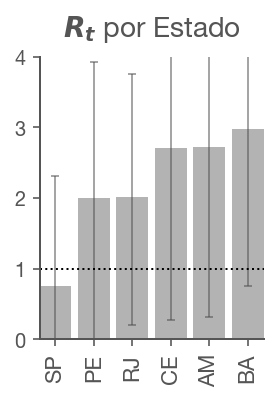

# Covid-19 Rt para o Brasil

por Fernando Serboncini (20 de Abril de 2020)

Utilizando o [modelo](https://github.com/k-sys/covid-19/blob/master/Realtime%20R0.ipynb) criado por Kevin Systrom para [rt.live](https://rt.live/).

## O que é ?

 é a taxa de transmissão do vírus no tempo. O número representa, dado uma infecção por Covid-19, qual o número de novas pessoas que serão na média infectadas. Se , o número de infectados permanece constante no tempo (cada infectado infecta mais uma pessoa). Se , o vírus está em crescimento exponencial.

As medidas de isolamento existem para manter  baixo. Um número  significa que as medidas estão funcionando.

## Mudanças no modelo original

Dados obtidos no site [covid.saude.gov.br](https://covid.saude.gov.br).

O modelo original usa o número de casos confirmados para determinar .
O número de casos no Brasil é muito instável pois varia com a política de testes.

Apesar de o número de mortes também poder estar sub (ou super) estimado, a metodologia não se alterou, o que faz a relação dinâmica funcionar melhor.

Para isso, utilizamos uma predição do número de casos baseado no número de mortes, e só usamos os valores de número de casos, para os dias em que não é possível predizer.

## Resultados

O notebook do estudo encontra-se [aqui](https://github.com/fserb/covid19-rt/blob/master/Rt.br.ipynb).

